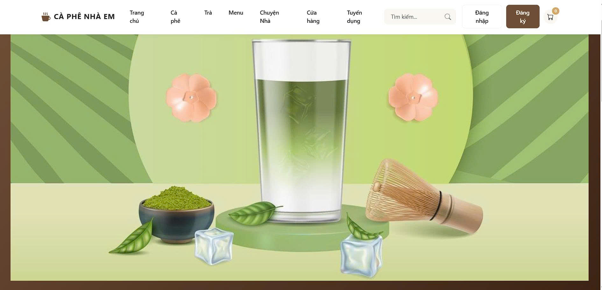
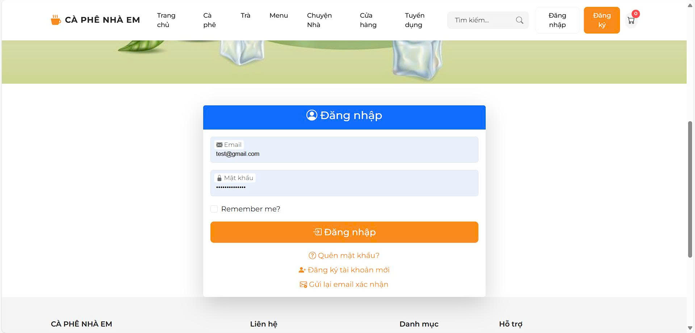
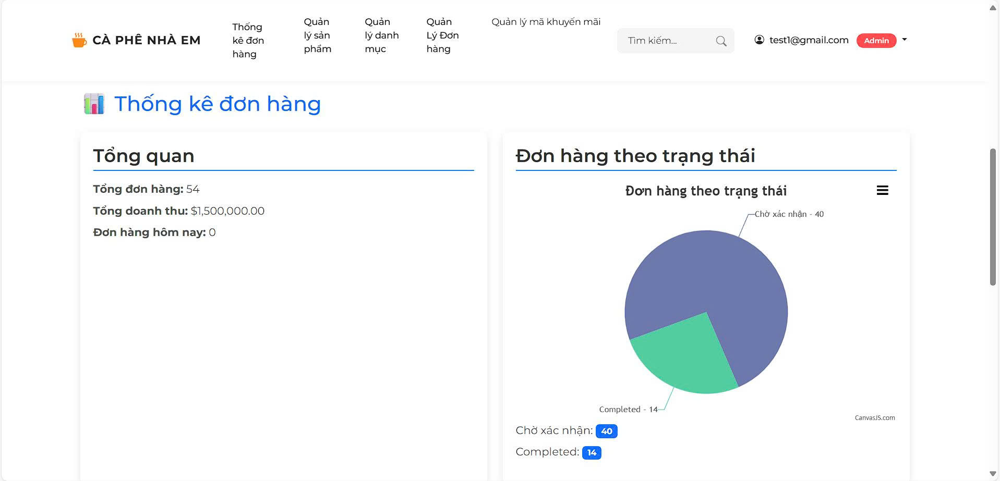
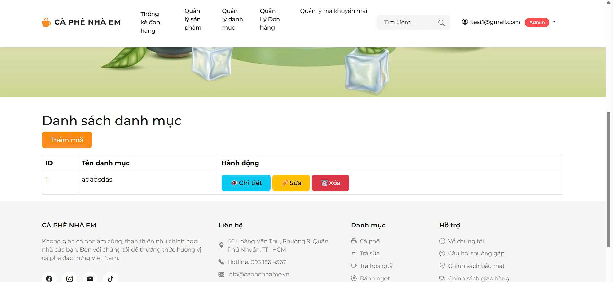
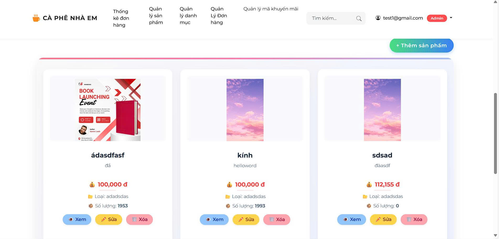
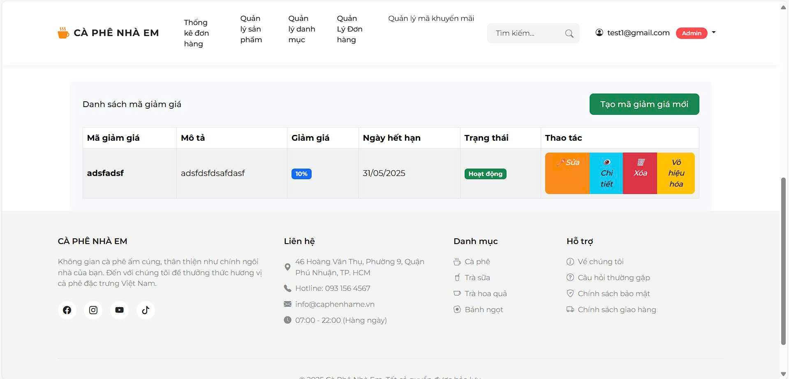
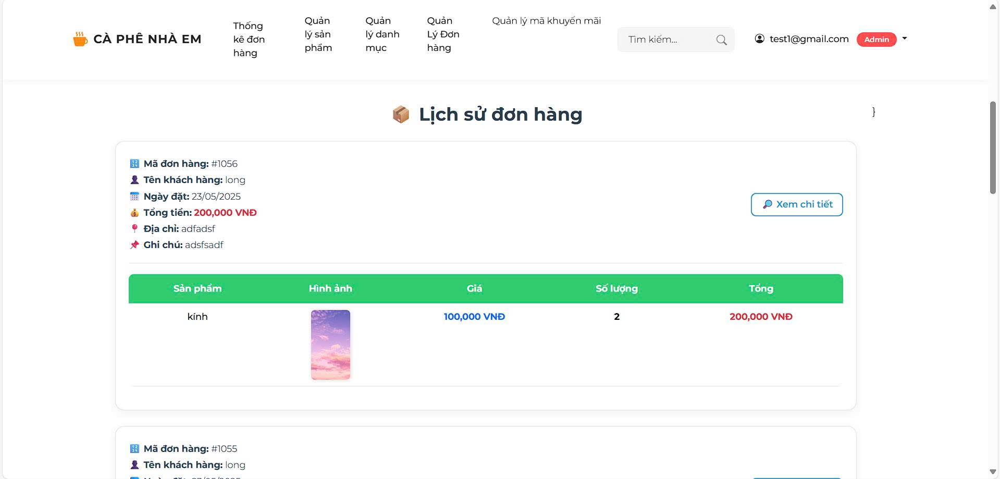
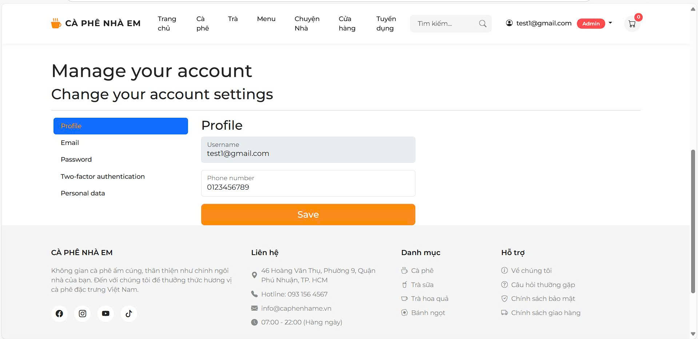

# ☕ Coffee Shop - ASP.NET MVC Razor  
📌 *[View Vietnamese version](README_vn.md)*

> An online sales system for a coffee shop developed using ASP.NET MVC (Razor Pages).  
Supports 3 user roles with clear permission control: Visitor, Customer, and Administrator.

---

## 🧩 Main Features

### 🧍‍♂️ Visitor (Not logged in)
- View product listings
- View the "About Us" page

---

### 👤 Customer (After login)
- Register, login, forgot password
- Manage shopping cart
- Create orders
- View order details
- Payment via **VNPay**
- View purchase history
- **Export invoice to PDF**

---

### 🛠️ Administrator (Admin)
- Manage products (CRUD)
- Manage discount codes
- Manage product categories
- View product sales statistics
- View purchase history of all customers

---

## ⚙️ Technologies Used

- ASP.NET MVC (.NET 9)
- Razor Pages
- Entity Framework Core
- SQL Server
- Identity (role-based authorization)
- VNPay Integration
- SelectPdf (export invoice PDF)
- Chart.js (analytics & charting)

---

## 🚀 Getting Started

### 1. Clone the project
```bash
git clone https://github.com/thanhlongqax/WebsiteCoffeeShop
cd WebsiteCoffeeShop
````

### 2. Configure the connection string

Update the connection string in `appsettings.json`:

```json
"ConnectionStrings": {
  "DefaultConnection": "Server=.;Database=;Trusted_Connection=;"
},
"VNPay": {
  "TmnCode": "",
  "HashSecret": "", // Ví dụ
  "BaseUrl": "https://sandbox.vnpayment.vn/paymentv2/vpcpay.html", // Ví dụ URL của môi trường Sandbox
  "ReturnUrl": "" // Ví dụ thực tế
},
```

### 3. Create the database

Run migration and update the database:

```bash
dotnet ef migrations add Init
dotnet ef database update
```

### 4. Run the application

```bash
dotnet run
```

---

## 🔐 User Role & Access Control

| Role         | Description          | Access                                                 |
| ------------ | -------------------- | ------------------------------------------------------ |
| **User**     | Not logged in        | `/`, `/products`, `/about`                             |
| **Customer** | Logged-in user       | Cart, Orders, Checkout, Purchase History               |
| **Admin**    | System administrator | Dashboard, Stats, Manage Products, Coupons, Categories |

Implemented with `RoleManager` and `UserManager`.

---

## 💳 VNPay Integration

* Merchant information, ReturnUrl, and NotifyUrl are pre-configured
* After successful payment, order status is automatically updated

---

## 🧾 PDF Invoice Export

* After completing the payment, customers can download the invoice as a PDF
* Library used: `SelectPdf`

---

## 📊 Statistics & Reports

* The Admin Dashboard displays:

  * Number of products sold
  * Revenue and profit by day/month
  * Top 5 best-selling products
  * Orders by status
  * Charts generated with **Chart.js**

---

## 📷 UI Screenshots

📌 Here are some screenshots from the system:

### 🏪 About Page



### 🔐 Login Page



### 📊 Statistics Dashboard



### 🗂️ Category Management



### 📦 Product Management



### 🎫 Discount Code Management



### 📜 Order History



### ⚙️ Account Settings



---

## 👤 Author

**Thanh Long**

🚀 *Made with ❤️ by Long*

📧 **Contact**: [thanhlongndp@gmail.com](mailto:thanhlongndp@gmail.com)

---

## 📄 License

MIT License © 2025 \[Thanh Long]